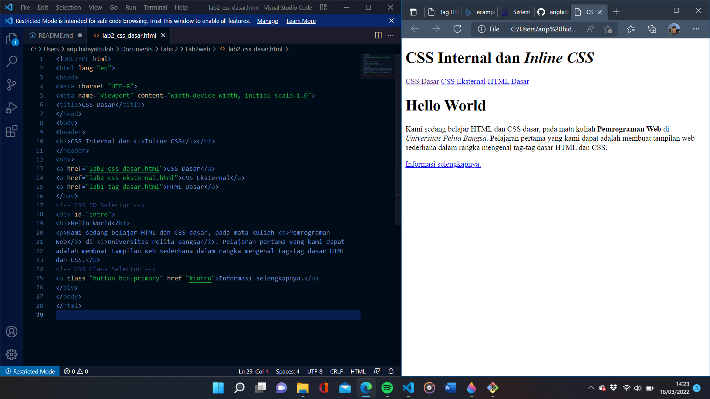
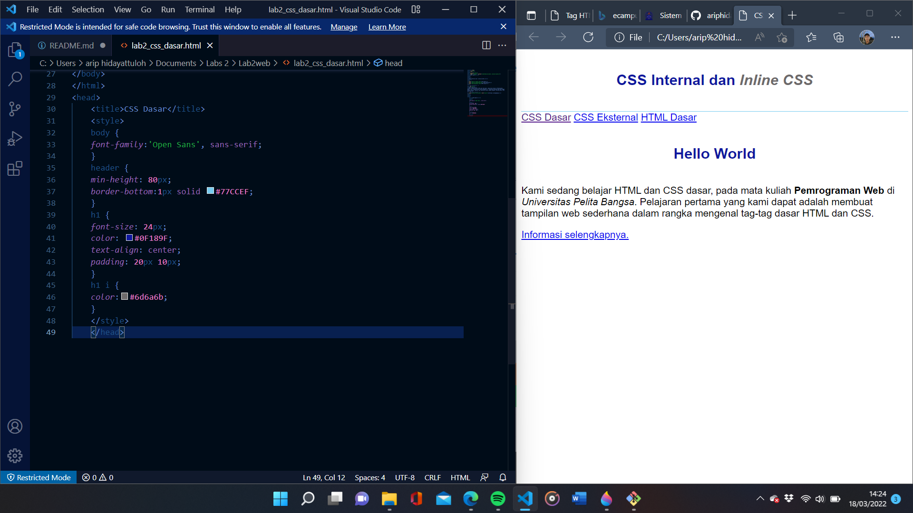
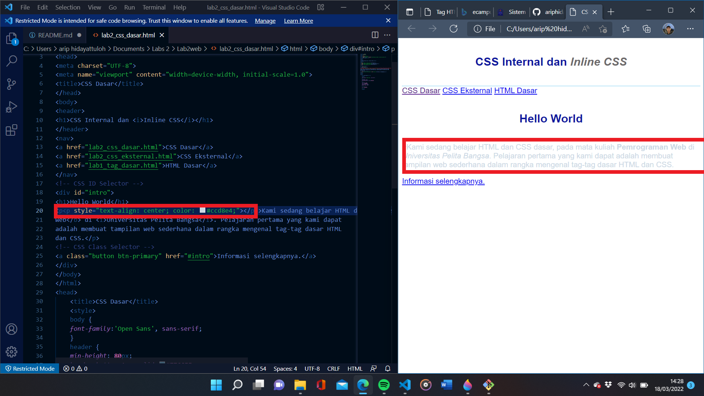
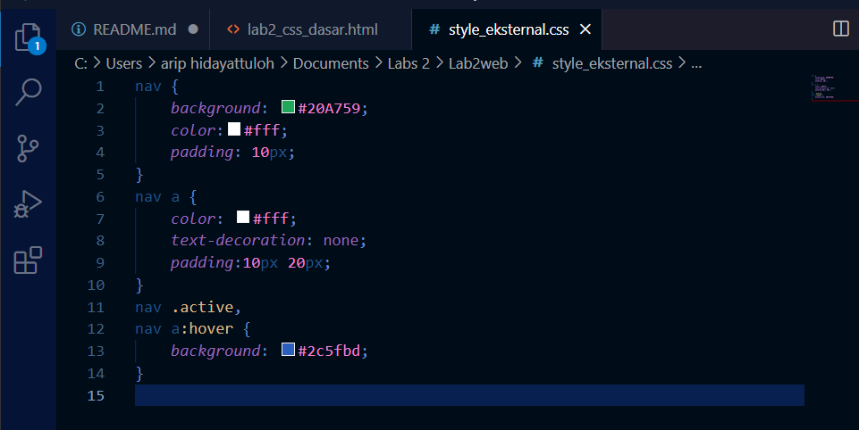
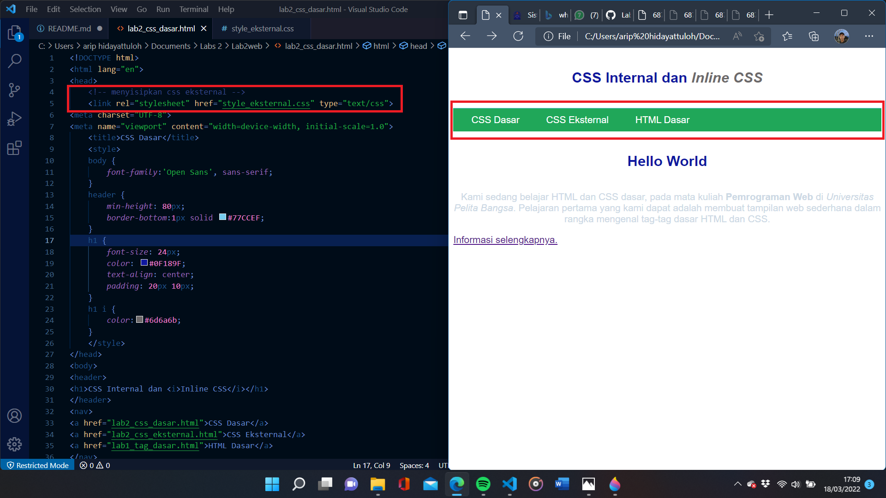
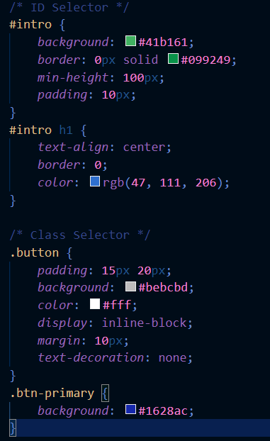
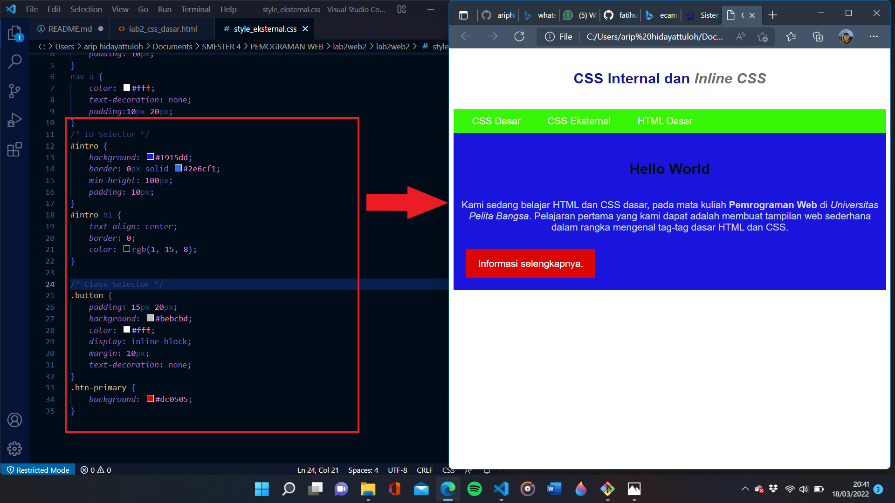
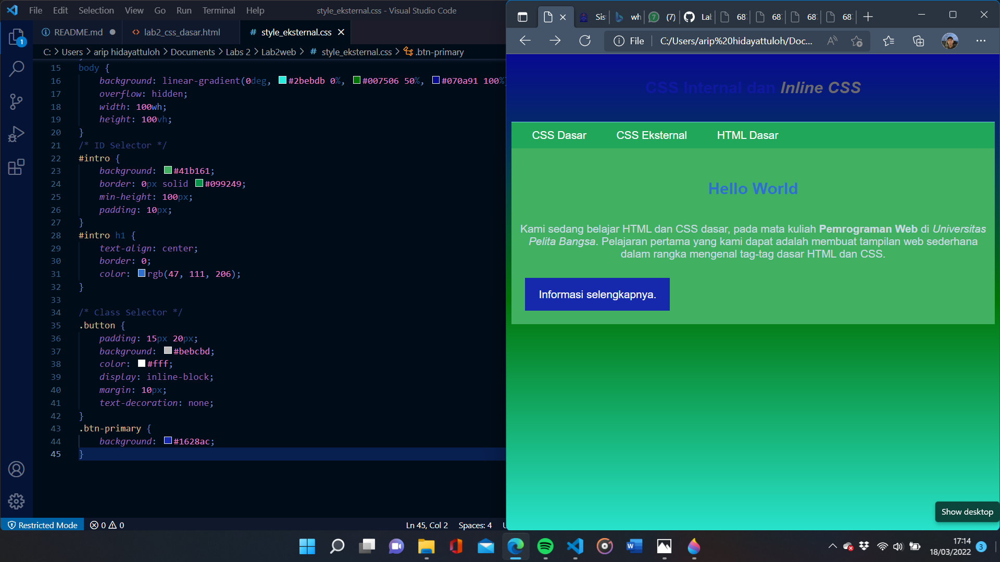
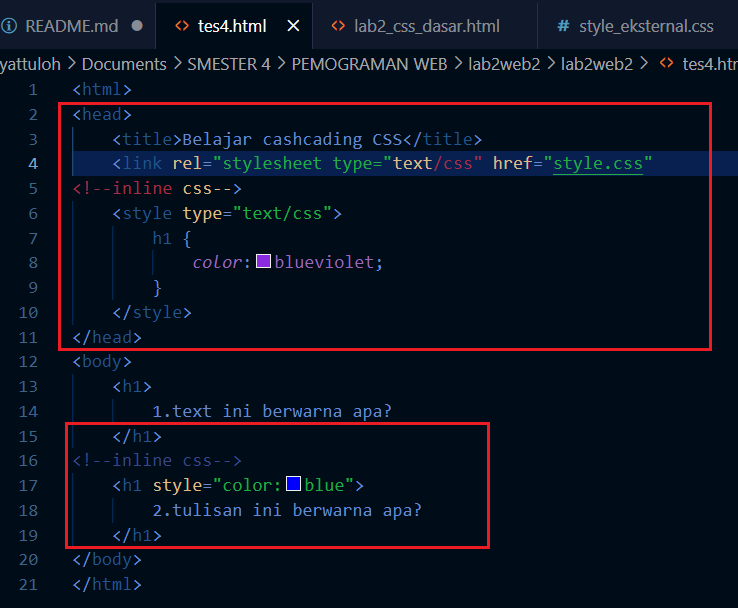
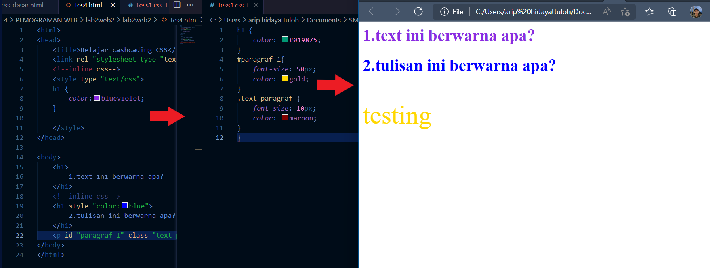

# Pratikum 2

## Nama    : Arip hidayattuloh

## NIM     : 312010244

## Kelas   : TI.20.B.1

## Instruksi Praktikum

1. Persiapkan text editor misalnya VSCode.

2. Buat file baru dengan nama lab2_css_dasar.html

3. Buat struktur dasar dari dokumen HTML.

4. Ikuti langkah-langkah praktikum yang akan dijelaskan berikutnya.

5. Lakukan validasi dokumen css dengan mengakses `https://jigsaw.w3.org/css-validator/`

Langkah-langkah Praktikum.

`1. Membuat dokumen HTML`

Buatlah dokumen HTML seperti dibawah ini

dan Selanjutnya buka pada brwoser untuk melihat hasilnya.

`2. Mendeklarasikan CSS Internal`

Kemudian tambahkan deklarasi CSS internal seperti berikut pada bagian head dokumen.
Selanjutnya simpan perubahan yang ada, dan lakukan refresh pada browser untuk melihat hasilnya.

`3. Menambahkan Inline CSS`

Kemudian tambahkan deklarasi inline CSS pada tag `
` seperti berikut.

Simpan kembali dan refresh kembali browser untuk melihat perubahannya.

`4. Membuat CSS Eksternal`
Buatlah file baru dengan nama style_eksternal.css kemudian buatlah deklarasi CSS seperti berikut.

Kemudian tambahkan tag `<link>` untuk merujuk file css yang sudah dibuat pada bagian `<head>`

Selanjutnya refresh kembali browser untuk melihat perubahannya.

`5. Menambahkan CSS Selector`

Selanjutnya menambahkan CSS Selector menggunakan ID dan Class Selector. Pada file
`style_eksternal.css`, tambahkan kode berikut.

Kemudian simpan kembali dan refresh browser untuk melihat perubahannya.

# Pertanyaan dan Tugas
## 1. Lakukan eksperimen dengan mengubah dan menambah properti dan nilai pada kode CSS dengan mengacu pada CSS Cheat Sheet yang diberikan pada file terpisah dari modul ini.

jawaban

## 2. Apa perbedaan pendeklarasian CSS elemen h1 {...} dengan #intro h1 {...}? berikan penjelasannya!

jawaban

perbedaaannya jika hanya h1{} maka akan merubah semua yang ada didalam elemen h1 sedangkan intro h1 hanya akan merubah yang memiliki tag intro

## 3. Apabila ada deklarasi CSS secara internal, lalu ditambahkan CSS eksternal dan inline CSS pada elemen yang sama. Deklarasi manakah yang akan ditampilkan pada browser? Berikan penjelasan dan contohnya!

jawaban

jika ketiga CSS merubah elemen yang sama maka deklarasi tersebut akan mengikuti aturan prioritas dimana prioritas CSS nya seperti ini:

1. inline CSS
2. ID selector CSS
3. internal CSS
4. external CSS
contoh:
ini adalah tampilan coding pada html testing dimana terdapat 2 kalimat yang memiliki elemen yang sama yaitu h1:

disini bisa dilihat sudah terdapat 2 css mencoba merubah warna text h1 :

dan hasil adalah :

## 4. Pada sebuah elemen HTML terdapat ID dan Class, apabila masing-masing selector tersebut terdapat deklarasi CSS, maka deklarasi manakah yang akan ditampilkan pada browser? Berikan penjelasan dan contohnya! `( 
 )`

jawaban

# SEKIAN DARI SAYA 

ARIP HIDAYATTULOH